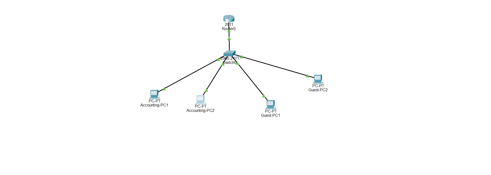

# Secure Enterprise Network Infrastructure Simulation

A secure multi-subnet network architecture designed for a mid-sized corporate branch using **Cisco Packet Tracer**. 

## 🌐 Topology Overview
This project simulates a secure corporate network segmented into dedicated logical zones to ensure department isolation, automated IP management, and infrastructure hardening.

*   **VLAN 10 (Accounting):** Internal corporate assets (`192.168.10.0/24`)
*   **VLAN 20 (Guest):** Isolated guest network (`192.168.20.0/24`)

---

## 🛠️ Features Implemented

### 1. Network Segmentation & Logic
*   **VLANs Deployment:** Segmented broadcast domains using a standardized port allocation plan (Ports 1-5 for Accounting, Ports 6-10 for Guests).
*   **Inter-VLAN Routing:** Configured Router-on-a-Stick via a single trunk link to efficiently route traffic between valid subinterfaces.
*   **Dynamic IP Allocation:** Deployed native DHCP pools on the Cisco router to fully automate client IP configuration.

### 2. Security Hardening & Access Control
*   **Firewall & Extended ACLs:** Implemented strict inbound Extended Access Control Lists (ACLs) to block Guest traffic from accessing corporate Accounting subnet databases.
*   **Switchport Security:** Hardened physical switch access by shutting down all unassigned interfaces (`Fa0/11 - 24`).
*   **Secure Management:** Enforced cryptographic SSH validation and disabled plain-text Telnet for all terminal lines.

---

## 🧪 Verification & Testing

### Test 1: Access Control Validation (Guest to Accounting)
*   **Action:** Executed a ping from `Guest-PC1` to `Accounting-PC1`.
*   **Result:** `Request timed out` (Success). The Extended ACL successfully intercepted and dropped unauthorized traffic.

### Test 2: Standard Inter-VLAN Routing (Accounting to Guest)
*   **Action:** Executed a ping from `Accounting-PC1` to `Guest-PC1`.
*   **Result:** `Reply from 192.168.20.2` (Success). Unrestricted network boundaries function normally.

---

## 🚀 How to Run the Simulation
1. Download and install **Cisco Packet Tracer**.
2. Clone this repository.
3. Open the `.pkt` file included in this directory.
4. Open any terminal on the host machines to test the live network security rules.
